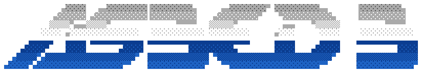

More about me at: <a href="https://asbedb.dev">asbedb.dev</a>

```bash                                                     
DISK : /dev/sideprojects ............. 97% full  WARN
Detecting peripherals...
  [x] Mechanical keyboard (loud)
  [x] Second monitor (logs only)
  [ ] Sleep schedule ...................... surprisingly healthy                    
                                                              
asbedb@node:/usr/asbedb$ tree
.
├── projects
│   ├── proxaform/
│   ├── Scapedle/
│   ├── tsImgScii/
│   └── others/                  # a fair few more actually
├── interests
│   ├── dev
│   │   ├── automation/          
│   │   ├── infrastructure-as-code/
│   │   ├── homelab/             # uptime: questionable
│   │   └── web/
│   │   ├── llms/
│   │   ├── agents/              
│   │   └──  local-models/        
│   └── open-source
│       ├── contributing/
│       ├── self-hosting/
│       └── reading-other-peoples-code/
└── stack
    ├── devops
    │   ├── .gitconfig           
    │   ├── azure-pipelines.yml
    │   ├── aws/
    │   ├── infra-as-code/  
    │   └── artifactory/         
    ├── observability
    │   └── splunk/              
    └── platforms
        ├── linux/               
        ├── microsoft/           
        └── cisco/               
```
<p align="left">
<a href="https://bsky.app/profile/asbedb.bsky.social" target="blank"></a>
<a href="https://linkedin.com/in/asbed" target="blank"></a>
</p>
